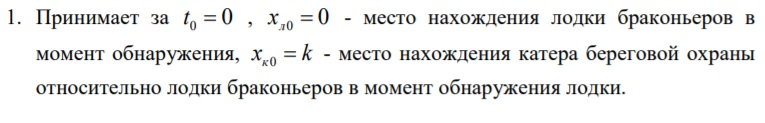
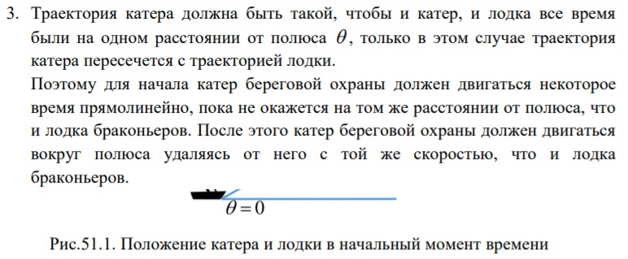
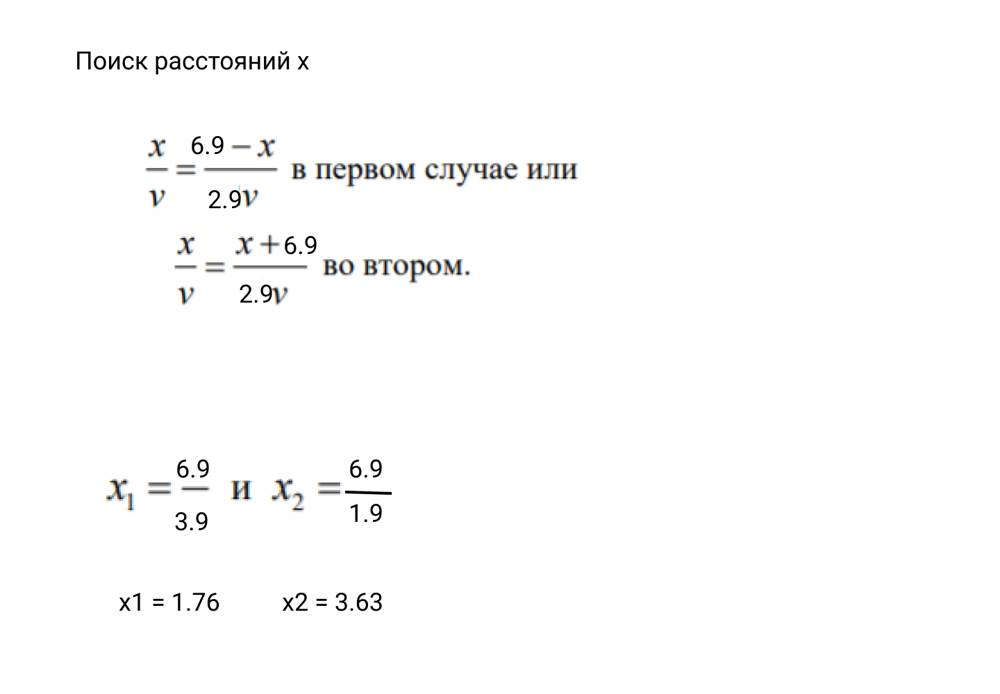
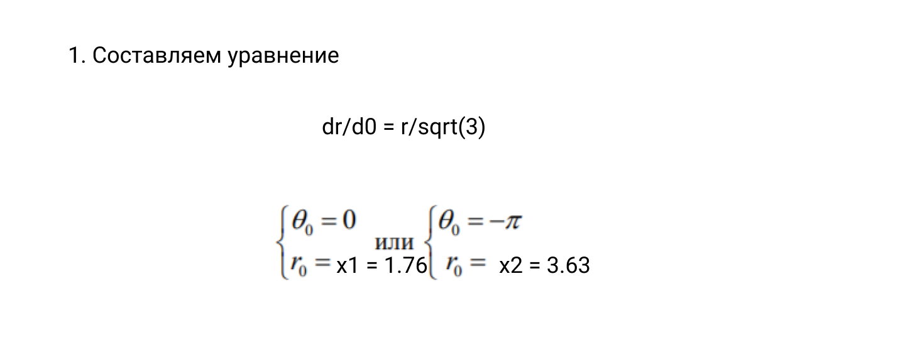
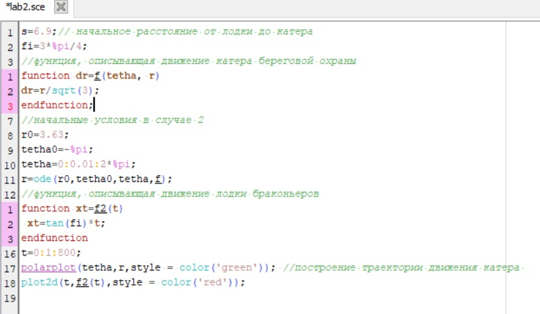
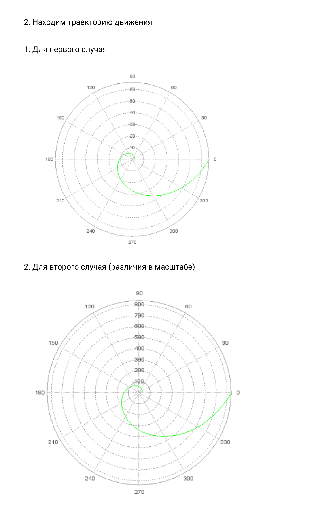
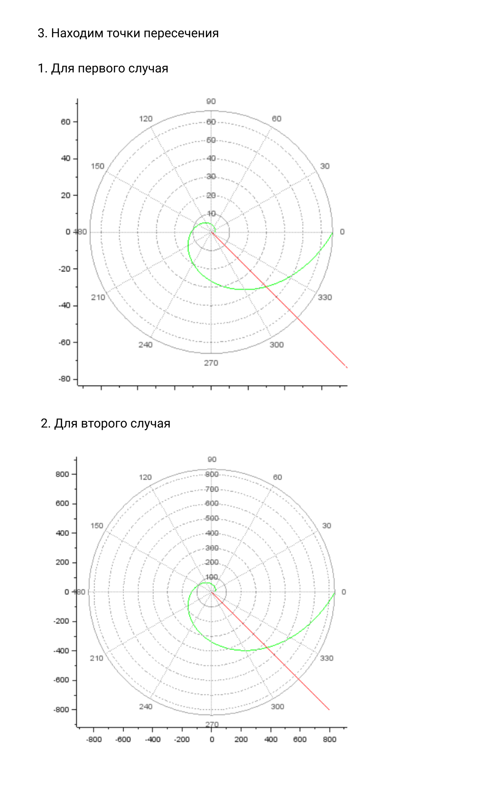

---
## Front matter
lang: ru-RU
title: Structural approach to the deep learning method
author: |
	Kuchenov I.V\inst{1,3}

## Formatting
toc: false
slide_level: 2
theme: metropolis
header-includes:
 - \metroset{progressbar=frametitle,sectionpage=progressbar,numbering=fraction}
 - '\makeatletter'
 - '\beamer@ignorenonframefalse'
 - '\makeatother'
aspectratio: 43
section-titles: true
---

# Задача о погоне

## Постановка задачи

Рассмотрим задачу преследования браконьеров береговой
охраной. На море в тумане катер береговой охраны преследует лодку браконьеров. Через определенный промежуток времени туман рассеивается, и лодка обнаруживается на расстоянии k км от катера. Затем лодка снова скрывается в тумане и уходит прямолинейно в неизвестном направлении. Известно, что скорость катера в 2 раза больше скорости браконьерской лодки.

## Цель

Необходимо определить по какой траектории необходимо двигаться катеру,
чтоб нагнать лодку.

## Ход решения

### 1. { #fig:001 width=70% }

### 2. { #fig:001 width=70% }

### 3. { #fig:001 width=70% }

### 4. Чтобы найти расстояние x (расстояние после которого катер начнет
двигаться вокруг полюса), необходимо составить простое уравнение. Пусть
через время t катер и лодка окажутся на одном расстоянии x от полюса. За
это время лодка пройдет x, а катер 6.9-x (или 6.9+x , в зависимости от
начального положения катера относительно полюса). Время, за которое они
пройдут это расстояние, вычисляется как x/v или 6.9-x/2.9v (во втором случае x+6.9/2.9v ). Так как время одно и то же, то эти величины одинаковы. Тогда неизвестное расстояние x можно найти из следующего уравнения:

{ #fig:001 width=70% }

### 5. Решение исходной задачи сводится к решению системы из двух
дифференциальных уравнений.

{ #fig:001 width=70% }

### 6. Построение графиков с помощью sci-lab

{ #fig:001 width=70% }
{ #fig:001 width=70% }
{ #fig:001 width=70% }
