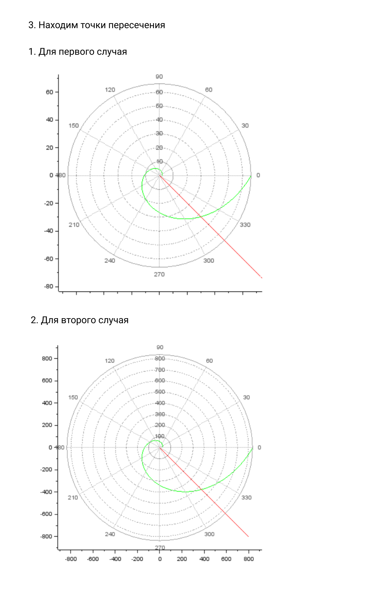

---
# Front matter
lang: ru-RU
title: "Отчёт лабораторной работы №2"
subtitle: ""
author: "Кученов Ирзилей Сайын Вячеславович, преподаватель: Кулябов Дмитрий Сергеевич"

# Formatting
toc-title: "Содержание"
toc: true # Table of contents
toc_depth: 2
lof: true # List of figures
lot: true # List of tables
fontsize: 12pt
linestretch: 1.5
papersize: a4paper
documentclass: scrreprt
polyglossia-lang: russian
polyglossia-otherlangs: english
mainfont: PT Serif
romanfont: PT Serif
sansfont: PT Sans
monofont: PT Mono
mainfontoptions: Ligatures=TeX
romanfontoptions: Ligatures=TeX
sansfontoptions: Ligatures=TeX,Scale=MatchLowercase
monofontoptions: Scale=MatchLowercase
indent: true
pdf-engine: lualatex
header-includes:
  - \linepenalty=10 # the penalty added to the badness of each line within a paragraph (no associated penalty node) Increasing the value makes tex try to have fewer lines in the paragraph.
  - \interlinepenalty=0 # value of the penalty (node) added after each line of a paragraph.
  - \hyphenpenalty=50 # the penalty for line breaking at an automatically inserted hyphen
  - \exhyphenpenalty=50 # the penalty for line breaking at an explicit hyphen
  - \binoppenalty=700 # the penalty for breaking a line at a binary operator
  - \relpenalty=500 # the penalty for breaking a line at a relation
  - \clubpenalty=150 # extra penalty for breaking after first line of a paragraph
  - \widowpenalty=150 # extra penalty for breaking before last line of a paragraph
  - \displaywidowpenalty=50 # extra penalty for breaking before last line before a display math
  - \brokenpenalty=100 # extra penalty for page breaking after a hyphenated line
  - \predisplaypenalty=10000 # penalty for breaking before a display
  - \postdisplaypenalty=0 # penalty for breaking after a display
  - \floatingpenalty = 20000 # penalty for splitting an insertion (can only be split footnote in standard LaTeX)
  - \raggedbottom # or \flushbottom
  - \usepackage{float} # keep figures where there are in the text
  - \floatplacement{figure}{H} # keep figures where there are in the text
---

# Цель работы

Цель данного шаблона --- построение математической модели для
выбора правильной стратегии при решении задач поиска.

# Задание

Определить по какой траектории необходимо двигаться катеру,
чтоб нагнать лодку.

# Выполнение лабораторной работы

1. Постановка задачи

На море в тумане катер береговой охраны преследует лодку браконьеров.
Через определенный промежуток времени туман рассеивается, и лодка
обнаруживается на расстоянии 6,9 км от катера. Затем лодка снова скрывается в тумане и уходит прямолинейно в неизвестном направлении. Известно, что скорость катера в 2,9 раза больше скорости браконьерской лодки. (11 Вариант)

2. Поиск расстояний x для двух случаев
Чтобы найти расстояние x (расстояние после которого катер начнет
двигаться вокруг полюса), необходимо составить простое уравнение. Пусть
через время t катер и лодка окажутся на одном расстоянии x от полюса. За это время лодка пройдет x , а катер k - x  (или k + x, в зависимости от
начального положения катера относительно полюса). Время, за которое они
пройдут это расстояние, вычисляется как x/v или k-x/2v (во втором
случае x+k/2v).
{ #fig:001 width=70% }

3. Нахождение траектории движения
Для построения траектории движения используется программа sci-lab
{ #fig:001 width=70% }

4. Нахождение точек пересечений
Для нахождения точек пересечений строим график движения браконьерской лодки
{ #fig:001 width=70% }

# Выводы
Результат: Точки пересечения получены на графиках.
Вывод: Построили математическую модель, использовали sci-lab, нашли точки пересения с помощью формул, научились строить математическую модель для правильной стратегии при решении задач поиска.
